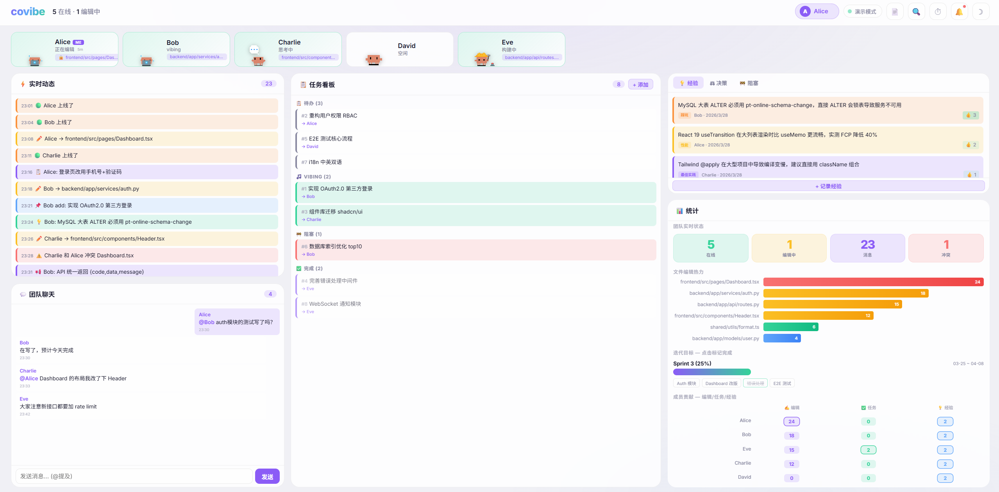

<p align="center"></p>

# covibe

> **Co-Vibe — Multi-person Vibe Coding Collaboration Toolkit**

🌐 [中文版](README.md)

[](https://www.npmjs.com/package/covibe)
[](LICENSE)

A group of people, each with their own AI, vibe coding together.
covibe makes every person's AI aware of what teammates are doing, what decisions they've made, and what pitfalls they've encountered.



## Install

```bash
npm install -g covibe
```

### Native IDE Integration

**Claude Code** — covibe is a native Claude Code Skill. Type in your chat:
```
/covibe init          # AI calls covibe CLI automatically
/covibe audit         # AI runs audit and suggests improvements
/covibe board add     # AI adds tasks to shared board
```

**Cursor** — Auto-generate `.cursorrules` from your CLAUDE.md:
```bash
covibe cross-ide cursor
```

**Windsurf** — Auto-generate `.windsurfrules`:
```bash
covibe cross-ide windsurf
```

Different team members use different IDEs? No problem — covibe keeps rules consistent across all of them.

## Get Started in 30 Seconds

```bash
cd your-project
covibe init           # Auto-detect tech stack → generate full AI workspace
covibe audit          # Audit your AI workspace health (100-point score)
covibe team init      # Enable team collaboration mode
covibe sync start     # Start real-time P2P sync (LAN, no server needed)
```

---

## Why covibe?

### Without covibe

Alice (PM) uses Cursor, Bob (developer) uses Claude Code, Charlie (frontend) uses Windsurf. Three people vibe coding on the same project:

- Alice tells her AI to remove phone number validation from the login page. Bob doesn't know and adds it back
- Bob spends 3 hours fixing a MySQL migration bug. Next week Charlie hits the same issue — another 3 hours wasted
- New intern David opens the project. His AI has zero context — no idea about conventions, how to run tests, or commit format
- Alice and Charlie edit `Header.tsx` simultaneously. Merge conflicts everywhere, and both AIs think they're right

### With covibe

```
covibe init           → David's AI instantly understands the entire project
covibe team init      → Team rules auto-sync to everyone's AI
covibe sync start     → Real-time awareness of who's editing what
covibe experience add → Bob's hard-won lessons auto-remind Charlie
covibe coordinate     → AI analyzes who's best suited for each task
```

---

## Not Just for Teams — Works Solo Too

You might not be on a team, but you have two computers: a desktop at the office and a laptop on the go. Both running Claude Code on the same project.

```bash
# Desktop: start sync server (runs in background)
covibe sync start &

# Laptop: connect
export HARNESS_SYNC_SERVER="http://desktop-ip:3456"

# Both devices' AIs now share context:
# - Desktop edits sync to laptop's AI
# - Experiences shared across devices
# - Task board stays in sync
```

One person, multiple devices — covibe becomes a shared brain for all your AIs.

---

## Real-World Use Cases

### Case 1: New Team Member Onboarded in 10 Minutes

```bash
covibe team onboard
# ✓ Dev environment installed
# ✓ Personal config created (won't affect team settings)
# ✓ Member profile generated
# ✓ Top-10 team experiences injected
# ✓ AI instantly knows: tech stack, build commands, coding standards, quality rules
```

### Case 2: Preventing Decision Conflicts

```
Alice edits Button.tsx → covibe broadcasts: "alice is editing Button.tsx"
Alice commits → Decision record: "Changed buttons to rounded corners (user feedback)"

Bob's AI tries to edit Button.tsx:
  → PreToolUse hook fires
  → "⚠️ alice recently modified Button.tsx — she decided to use rounded corners (reason: user feedback)"
  → Bob's AI proactively informs Bob, avoiding conflict
```

### Case 3: Team Experience Auto-Transfer

```bash
# Bob records an experience
covibe experience add "Redis max_connections should not exceed 50, or OOM" \
  --category performance --tags redis,connection-pool

# Two weeks later, Charlie gets a Redis task
# covibe auto-injects:
## Team experiences (for reference)
# - [performance/bob] Redis max_connections should not exceed 50 👍3
```

### Case 4: AI-Powered Task Assignment

```bash
covibe coordinate "Add Slack integration: OAuth + messaging + webhooks"

## Assignment Suggestion
| # | Subtask | Assign to | Match | Reason |
|---|---------|-----------|-------|--------|
| 1 | OAuth flow | Bob | 95% | Built Feishu OAuth last month |
| 2 | Slack messaging | Charlie | 88% | Familiar with WebSocket |
| 3 | Frontend config | Alice | 92% | React expert, built similar page |
```

### Case 5: Live Dashboard with Pixel Characters

```bash
covibe dashboard
# Open http://localhost:3457?server=localhost:3456
# See animated pixel characters for each team member
# Real-time status: who's coding, thinking, blocked, or idle
```

---

## All Features

| Feature | Command | Description |
|---------|---------|-------------|
| **One-click init** | `covibe init` | Auto-detect stack → generate CLAUDE.md + configs |
| **Health audit** | `covibe audit` | 14 checks, 100-point score |
| **Auto-fix** | `covibe audit --fix` | Automatically fix harness issues |
| **Team setup** | `covibe team init` | Create team config + experience board |
| **Onboarding** | `covibe team onboard` | Interactive new member guide |
| **Config sync** | `covibe team sync` | Detect local vs team config conflicts |
| **Real-time sync** | `covibe sync start` | P2P WebSocket server (any member can host) |
| **Sync status** | `covibe sync status` | Who's online, who's editing what |
| **Task board** | `covibe board add/vibe/done` | Shared kanban with team visibility |
| **Add experience** | `covibe experience add` | Record team learnings with tags |
| **List experience** | `covibe experience list` | Browse by category and tags |
| **Upvote** | `covibe experience upvote` | Upvote useful experiences |
| **Auto-profile** | `covibe profile-gen` | Generate member profiles from git blame |
| **AI coordination** | `covibe coordinate "task"` | AI-powered task assignment |
| **Cross-IDE** | `covibe cross-ide cursor/windsurf` | Generate rules for other IDEs |
| **Dashboard** | `covibe dashboard` | Web UI with animated pixel characters |
| **Templates** | `covibe template <type>` | 10 template types |

---

## Security Model

| Aspect | Design |
|--------|--------|
| **Code never passes through server** | Sync only transmits file paths and decision summaries |
| **LAN only** | Server binds 0.0.0.0 but intended for internal network |
| **Token auth** | Auto-generated on `team init`, verified on every connection |
| **No persistent storage** | Server keeps last 100 messages in memory only |
| **Project isolation** | `--project` flag isolates different projects |

Even if the sync server were fully compromised, an attacker would only see who's editing which files — zero code content.

---

## Team Rules: Three-Tier Separation

| Level | Meaning | Can override? | Example |
|-------|---------|---------------|---------|
| **enforced** | Team law | No | No force push, no fake data |
| **recommended** | Team suggestion | Yes | Chinese commits, snake_case |
| **personal** | Personal preference | Freely | Execution style, model choice |

---

## Zero Dependencies

- **CLI**: Pure Node.js (>=18), zero npm dependencies
- **Sync Server**: Hand-rolled WebSocket protocol, no `ws` package needed
- **Hook scripts**: Pure bash + curl
- **Data**: JSON + Markdown, human-readable, Git-trackable
- **Storage**: Filesystem only, no database

---

## Supported Tech Stacks

Auto-detection engine supports:

| Language | Frameworks |
|----------|-----------|
| **Node.js / TypeScript** | React, Next.js, Vue, Nuxt, Svelte, Express, NestJS |
| **Python** | FastAPI, Django, Flask |
| **Go** | Standard project structure |
| **Rust** | Cargo projects |
| **Full-stack** | frontend/ + backend/ auto-detected |
| **Monorepo** | packages/ / apps/ + Turbo/Nx |

---

## Foundation: Harness Engineering

covibe is more than a collaboration tool — it's built on **Harness Engineering**, a methodology for constructing AI agent work environments.

> **Core insight**: A harness is not intelligence itself — it's the toolchain that unleashes intelligence. Same model, poor harness → mediocre results. Same model, great harness → expert-level results.

### Three-Axis Model

| Axis | Components | How covibe implements it |
|------|-----------|------------------------|
| **Tools** | MCP Servers, Shell, CLI | `covibe init` auto-configures |
| **Knowledge** | CLAUDE.md, experiences, memory | `covibe experience` for team knowledge |
| **Permissions** | Hooks, team rules, sandbox | `harness.team.json` three-tier rules |

### Eight Design Patterns

| # | Pattern | Description |
|---|---------|-------------|
| 1 | **Constitution** | CLAUDE.md as structured AI "constitution" |
| 2 | **Memory Layering** | L1 working / L2 project / L3 global |
| 3 | **Evidence Gate** | Verifiable evidence before claiming done |
| 4 | **Hook Guard** | Pre/Post/Stop runtime guardrails |
| 5 | **Harness-First** | Build workbench before writing code |
| 6 | **Decision Protection** | Human vs AI decisions — tiered protection |
| 7 | **Experience Board** | Zero-infra team knowledge reuse |
| 8 | **AI Coordination** | Profile + git blame task matching |

### 10 Built-in Templates

```bash
covibe template claude-md      # CLAUDE.md constitution
covibe template hooks          # 7 hook guard patterns
covibe template workflow       # Dev workflow (4 project types)
covibe template audit          # 100-point audit checklist
covibe template team           # Team config + setup script
# ... and 5 more
```

---

## Credits

- [shareAI-lab/learn-claude-code](https://github.com/shareAI-lab/learn-claude-code) — Harness three-axis model
- [lazyFrogLOL/Harness_Engineering](https://github.com/lazyFrogLOL/Harness_Engineering) — Constitution pattern, memory layering
- [Disrush/teamvibe](https://github.com/Disrush/teamvibe) — Decision version control
- [oh-my-claudecode](https://github.com/Yeachan-Heo/oh-my-claudecode) — Hook guard system
- [clawd-on-desk](https://github.com/anthropics/clawd-on-desk) — Pixel character assets (MIT License)

## License

MIT
